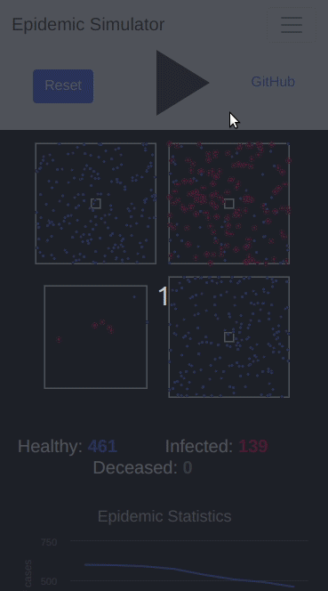

<h1 align="center">Epidemic Simulator</h1>
<h3 align="center">Modeling how different parameters affect the spread of an epidemic</h3>

<h4 align="center">Mobile View</h4>

## Model
* There are 3 possible states for an agent: HEALTHY, INFECTED, DECEASED
* An agent's status moves from the HEALTHY to the INFECTED state, whenever contact is made with another infected agent's infection radius, with a probability proportional to the rate of contraction of the disease
* An INFECTED agent eventually moves to the HEALTHY or DECEASED state depending on the mortality rate
* The boxes represent separate isolated communities- agents occassionaly travel between them
* The smaller squares at the centers represent central locations or hubs like grocery stores or schools where population density is high
* The box at the bottom left corner represents an isolation centre like a hospital or quarantine zone
* The graphs and numbers show real time statistics related to the simulation

## Controls
* <b>Rate of Contraction:</b> used to model how contagious the disease is- also models hygiene protocols like washing hands and wearing face masks (the rate at which a HEALTHY agent can move to the INFECTED state)
* <b>Mortality rate:</b> the rate at which an INFECTED agent can move to the DECEASED state
* <b>Isolation:</b> the rate at which infected agents are detected and moved to isolation or quarantine (eg. hospitals)
* <b>Social Distancing:</b> a safety measure to reduce the spread of the epidemic by reducing proximity between agents
* <b>Travel:</b> the rate of travel between different isolated communities
* <b>Central Locations:</b> the rate of increase of population density at central hubs
* <b>Simulation speed:</b> the frames per second of the simulation 

## Learnings
* The spread is affected if, inspite of social distancing protocols, people still occassionaly visit central locations, like grocery stores
* Isolation is beneficial although asymptomatic cases affect detection and isolation
* Travel between different communities affects the spread of the epidemic
* Premature stoppage of safety protocols can cause a resurgence
* Rate of contraction, radius of infection and population density drastically affect the spread of the epidemic

<em>
Please Note: This is just a simulation and does not represent any real world data or situations in any way.   
</em>

Inspired by: [3Blue1Brown](https://www.youtube.com/channel/UCYO_jab_esuFRV4b17AJtAw)